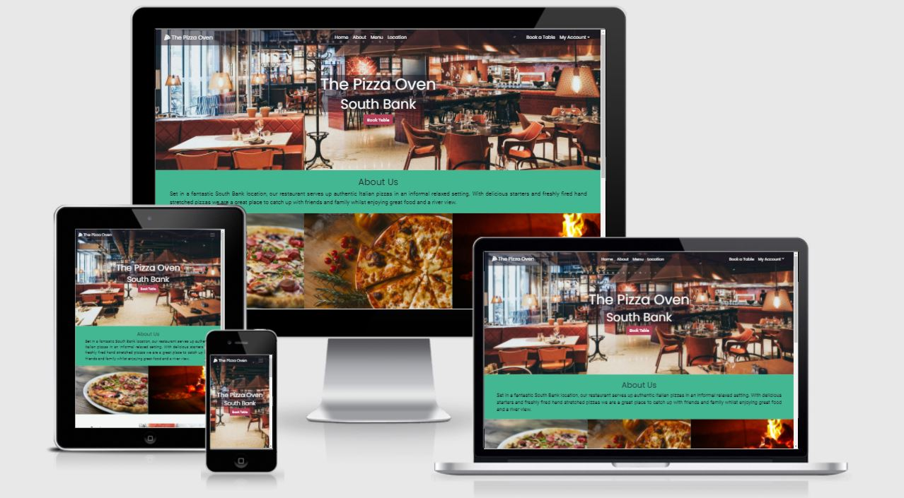
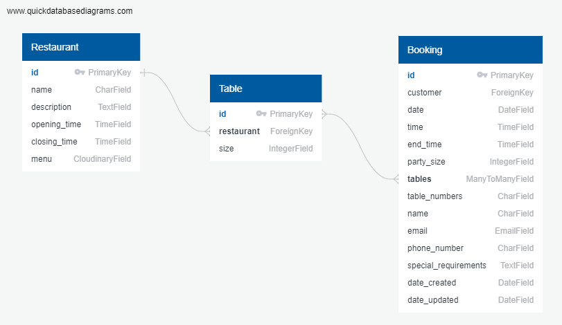
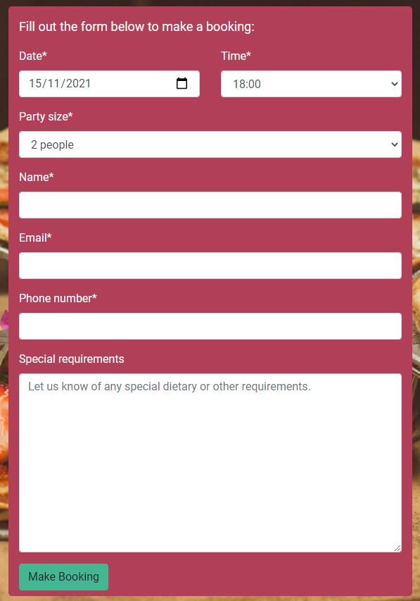
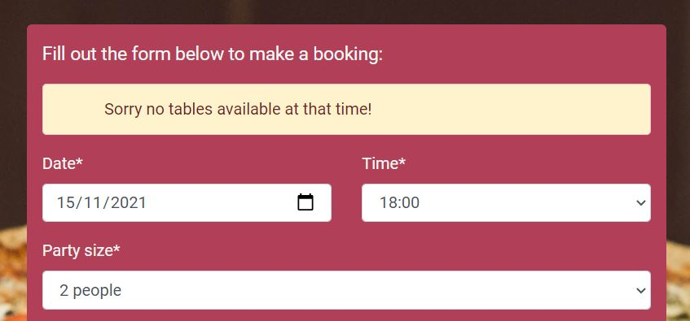
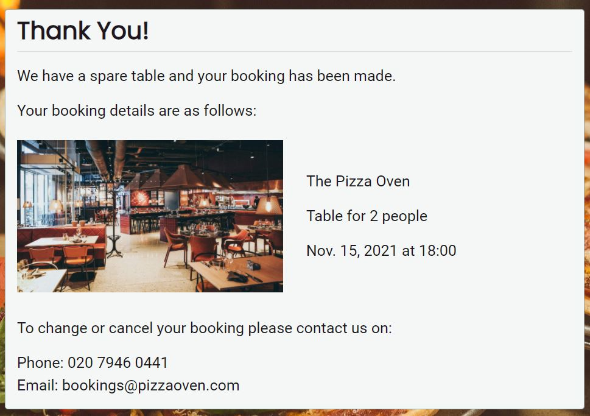

# The Pizza Oven

This is the website for a pizza restaurant located on the South Bank in London. The site consists of a homepage to provide information about the restaurant and attract customers to visit and eat there. It also contains a table booking system that allows customers to book a table at a specific date and time. The main goal of the site is to provide information about the restaurant and allow customers to book a table, instantly and easily. It allows the restaurant owner to take and keep track of bookings from their customers.

[The live site can be found here.](https://the-pizza-oven.herokuapp.com/)

## User Stories

* ### As a customer:

    **General**
    * I can view a menu so that I can see what food is available.
    * I can see a map of the restaurant location so that I can easily find the restautant.

    **Bookings**
    * I can easily specify a date and time for a booking so that I can quickly book a table for when I want it.
    * I can easily specify the size of my party for a booking so that I can ensure I book a table of the correct size.
    * I can detail special or dietary requirements when I book so that I can inform the restaurant.
    * I can see whether a table is abailable at my specified booking time so that I can confirm my booking straight away.
    * I can receive an email with my booking details so that I can have a reminder of the details of my booking.
    * I can register for an account so that I can review or change my bookings.

* ### As a registered customer:

    **Bookings**
    * I can view a list of bookings I have made so that I can easily select and update the individual booking information.
    * I can view and amend bookings I have made so that I can change the information as required.
    * I can view and cancel a booking I have made so that I can easily let the restaurant know I won't be attending.
    * I can save my personal information so that I can save time when booking in the future.

* ### As a restaurant owner:

    **Restaurant**
    * I can set the opening and closing times of my restaurant so that bookings will only be made when the restaurant is open.
    * I can view, add, update or remove tables from the booking system so that I can ensure the correct number of tables available for booking.

    **Bookings**
    * I can view a list of table bookings so that I can see how many customers will be visiting each day.
    * I can view my customers' special requirements so that I can respond accordingly.
    * I can assign a restaurant table number to the customer bookings so that I can plan the seating in my restaurant.
    * I can view, update or cancel bookings so that I can manage the daily bookings.
    * I can see when a customer has made or updated a booking so that I can review the information.

## Design

### Wireframes

The site is designed to be simple to use thus allowing a customer to quickly book a table. The following wireframes were created using [Balsamiq](https://balsamiq.com/wireframes/desktop/) to help plan the layout of the site:

* Desktop view wireframes
    * [Homepage](readme/wireframes/home-wireframe.png)
    * [Make Booking Page](readme/wireframes/make-booking-wireframe.png)
    * [My Bookings Page](readme/wireframes/my-bookings-wireframe.png)
    * [Manage Bookings Page](readme/wireframes/manage-bookings-wireframe.png)

* Tablet view wireframes
    * [Homepage](readme/wireframes/home-wireframe-tablet.png)
    * [Make Booking Page](readme/wireframes/make-booking-wireframe-tablet.png)
    * [My Bookings Page](readme/wireframes/my-bookings-wireframe-tablet.png)
    * [Manage Bookings Page](readme/wireframes/manage-bookings-wireframe-tablet.png)

* Mobile view wireframes
    * [Homepage](readme/wireframes/home-wireframe-mobile.png)
    * [Make Booking Page](readme/wireframes/make-booking-wireframe-mobile.png)
    * [My Bookings Page](readme/wireframes/my-bookings-wireframe-mobile.png)
    * [Manage Bookings Page](readme/wireframes/manage-bookings-wireframe-mobile.png)

In the course of creating the site another two pages, booking confirmed (adapted from the my bookings page layout) and booking detail (adapted from the manage bookings page layout) were also created.

### Models and Database Schema

The database schema was created using [Quick Database Diagrams](https://www.quickdatabasediagrams.com/)

The site is based around three custom models:
* **Restaurant** - This provides some general information about the restaurant. It allows the restaurant owner keep their homepage fresh by updating the description or the menu. It also allows them to set the restaurant opening and closing times which define the first and last slot of the booking system. The inclusion of a restaurant model with tables connected via a Foreign Key relationship would allow, without too many changes, the expansion of the booking system to multiple restaurants in the future.

* **Table** - This model is connected to the Restaurant model through a Foreign Key relationship. It allows the addition to the booking system of a table of a certain size. The decision has been made to restrict the table sizes in the system to just the two most common sizes, 2 person and 4 person tables. These can be combined to create larger tables to cover all party sizes.

* **Booking** - This model contains all the required information about the booking including the date, time and party size. The booking end time is calculated automatically with two hours allowed for each booking. Tables are connected to bookings through a Many to Many relationship and searching through the bookings for each table allows the booking system to check whether there are tables avaialable at the required booking date and time. The model also provides information about the customer who made the booking and if the customer is a registered user the booking will be connected to their AllAuth user model via a Foreign Key relationship. The date created and updated fields were intended to be used alert the restaurant owner when a booking had been updated however over the course of development a simpler 'updated' Boolean field was chosen instead.

## Features

### Existing Features

* **Colour Scheme**
    * The website is for an Italian pizza restaurant and shades of red, white and green have been used throughout the site to hint at the Italian flag. [ColorSpace](https://mycolor.space/) and [Colormind](http://colormind.io/) were used to help select the colours required.
    * The main colours used are:
        * #F4F7F5 for the off white
        * #43b792 for the green
        * #B03F57 for the red
        * #201622 for the darker accents

* **Navigation Bar**
    * The navigation bar is found on all pages and allows the user to easily navigate to the important parts of the site without using the browser navigation buttons.
    * It is identical on all pages and is fixed to the top of the page making it easy for the user to locate.
    * The My Account dropdown contains different options depending on user status quickly alerting the user as to whether or not they are logged in. It also contains extra options only visible to the Superuser.
    * The menu collapses to a toggler on smaller screens allowing for easy navigation across all devices.
    
    

* **Homepage**
    * This page provides the user with information about the restaurant and hopefully convinces them to book a table. It provides two links to the booking form, one in the navigation bar and a button below the heading making it even easier to book a table.

    * The imagery quickly alerts the user to what the restaurant serves and entices them with tasty looking food.
    
    

    * The view menu button allows the user to browse the menu available before booking. When combined with the Restaurant model it also allows the restaurant owner to keep the homepage fresh and up to date by uploading the latest menu.

    

    * The location section provides all the information the user requires to find the restaurant which again makes booking a table a more appealing prospect.

    

* **Make Booking and Booking Confirmation**
    * The make booking page contains a simple booking form allowing the user to book a table quickly and easily.
    * The use of a dropdown menu of booking slots ensures that the user does not accidently submit an invalid booking time. Similarly the party size dropdown controls the party sizes that are allowed.
    * The special requirements box allows the user send any requirements they may have directly to the restaurant.

    

    * The form validation alerts the user if there are no tables available at their booking time allowing them to book a table instantly rather than awaiting a response from the restaurant.

    

    * The booking confirmation confirms to the user that a table is avaiable providing confidence that a booking has been made. It also confirms the details of the booking they have just made.

    
